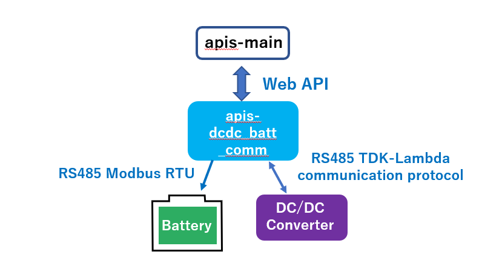

**apis-dcdc\_batt\_comm Specification**

**Rev 0.58**

# **Contents**

- [**Contents**](#contents)
- [**1. Terms and abbreviations**](#1-terms-and-abbreviations)
- [**2. Overview**](#2-overview)
- [**3. Software directory structure**](#3-software-directory-structure)
- [**4. Software module overview**](#4-software-module-overview)
  - [**4.1. ESSXServer**](#41-essxserver)
  - [**4.2. Controller (ESSXTypeOES)**](#42-controller-essxtypeoes)
- [**5. Software module details**](#5-software-module-details)
  - [**5.1. ESSXServer**](#51-essxserver)
    - [**5.1.1. Starting the ESSXServer**](#511-starting-the-essxserver)
    - [**5.1.2. ESSXServer start-up options, etc.**](#512-essxserver-start-up-options-etc)
    - [**5.1.3. ESSXServer configuration file**](#513-essxserver-configuration-file)
    - [**5.1.4. ESSXServer WEB API and specifications**](#514-essxserver-web-api-and-specifications)
      - [**5.1.4.1. WEB API request and response values**](#5141-web-api-request-and-response-values)
  - [**5.2. Controller**](#52-controller)
    - [**5.2.1. ESSXtypeOES**](#521-essxtypeoes)
      - [**5.2.1.1. Design response speed**](#5211-design-response-speed)
      - [**5.2.1.2. class ESSXTypeOES**](#5212-class-essxtypeoes)
      - [**5.2.1.3. Web API methods**](#5213-web-api-methods)
  - [**5.3. Devices**](#53-devices)
    - [**5.3.1. EZA2500Device.py**](#531-eza2500devicepy)
    - [**5.3.1.1. read(self, size)**](#5311-readself-size)
    - [**5.3.1.2. write(self,size)**](#5312-writeselfsize)
    - [**5.3.2. BatteryEmulator**](#532-batteryemulator)
  - [**5.4. Low-level devices**](#54-low-level-devices)
    - [**5.4.1. RS485(essx\_rs485.py)**](#541-rs485essx_rs485py)
    - [**5.4.2. ESSXModbusClient(essx\_modbus.py)**](#542-essxmodbusclientessx_modbuspy)
- [**6. OSS licensing**](#6-oss-licensing)

 

# **1. Terms and abbreviations**

| **Term**        | **Explanation**                                                                                                                                            |
| --------------- | ---------------------------------------------------------------------------------------------------------------------------------------------------------- |
| apis-main       | Software for energy sharing developed by Sony CSL that enables autonomous decentralized control                                                            |
| Main Controller | Web application developed by Sony CLS for displaying the conditions of each node installed by apis-main and the conditions of energy sharing in real time. |
| EZA2500         | In this document, refers to EZA-2500-32048SC0, a custom product in the EZA2500 series, manufactured by TDK-Lambda.                                         |    

 

# **2. Overview**

The dcdc\_batt\_comm component is a Device Driver for actual control of hardware to implement energy sharing according to instructions from apis-main. The controlled DC/DC Converter is assumed to be the TDK Lambda EZA2500, with communication using the proprietary TDK Lambda protocol via RS485 (Figure 2-1). The battery to be controlled is designed for communication using the Modbus RTU communication protocol via RS485. (The register map is a proprietary specification developed by Sony CSL.) Communication with apis-main is accomplished via a Web API developed by Sony CSL and implemented on a Python Bottle Web server running on dcdc\_batt\_comm. (Refer to the apis-main specifications for the Web API specifications.)

  
Figure 2-1

 

# **3. Software directory structure**

The directory structure is described below.

drivers/
|||
|---------------------|-----------------------------------------|
|essx\_server.py      |Web server built with bottle (ESSXServer)|  
|dcdc\_batt\_comm.yml |YAML configuration file          |  
|essx/                | ESSX Python module              |
|eza2500/             |   EZA2500 Python module         |  
|battery\_emulator    |  Battery emulator Python module |

 

# **4. Software module overview**
    
## **4.1. ESSXServer**

This is the main program for implementing the Web API. Executing this program starts up the Web server. The correspondence between URL paths and processing is described and the appropriate function is called when an HTTP request is received. After checking the parameters for each function, a call is made to the controller. The following controller is available.

  * essx.essx\_type\_oes  
   If the processing ends normally, a status code of 200 and the processing results are returned in JSON format according to the specification. If an exception is received by the controller, a status code and the exception description are simply returned in JSON format and the function for communication with devices, etc. is implemented in the controller to be described later.

 

## **4.2. Controller (ESSXTypeOES)**

The controller software module receives requests from ESSX Server, sends commands to the device, and returns a response. The controller also executes retry processing when an error occurs.

 

# **5. Software module details**
    
## **5.1. ESSXServer**

The specifications for the Web API used for information exchange between User and Main Controller are described below.

 

### **5.1.1. Starting the ESSXServer**

The server is started by executing the python essx\_server.py file in the essx directory. It may be necessary to use sudo, because permission to access the actual device file (/dev/ttyO2, etc.) and the direction control GPIO is required.

 

### **5.1.2. ESSXServer start-up options, etc.**

usage: essx\_server.py \[-h\] \[--host HOST\] \[--port PORT\] \[--debug\]  
\[--config CONFIG\]  
ESS Server  

optional arguments:  
\-h, --help show this help message and exit  
\--host  
\--port  
\--debug  
\--config

 

* -h, --help  
 Displays a help message
* --host  
 This is the address for listening on TCP/IP. The default is localhost. If access from other hosts is required, either the IP address of that host or 0.0.0.0 must be set.
* --port  
 This is the port number for listening on TCP/IP. The default is 8080.
* --debug  
 This specifies whether or not debugging messages are to be output.
* --config  
 This specifies the configuration file. The default is dcdc\_batt\_comm.yml.
* --goodbye  
 This specifies whether the /essx/goodbye API is enabled or disabled.

 

### **5.1.3. ESSXServer configuration file**

The configuration file is written in YAML. The default settings configuration file must be named dcdc\_batt\_comm.yml and placed in the same directory as essx\_server.py

> ess\_system:  
> &emsp;type: essx\_type\_oes  
> &emsp;dcdc\_dev:  
> &emsp;&emsp;name: dcdc1  
> &emsp;&emsp;config: dcdc\_default\_eza2500  
> &emsp;&emsp;class: ‘ESSXRS485’  
> &emsp;&emsp;vparams: \[“/dev/ttyO2”, 19200\]  
> &emsp;&emsp;kwparams:  
> &emsp;&emsp;&emsp;dir\_pin: “P8\_7”  
>    
> &emsp;battery\_dev:  
> &emsp;&emsp;name: battery  
> &emsp;&emsp;config: battery\_emulator  
> &emsp;&emsp;class: ‘ESSXModbus’  
> &emsp;&emsp;params: \[\]  
> &emsp;&emsp;kwparams:  
> &emsp;&emsp;&emsp;method: ‘rtu’  
> &emsp;&emsp;&emsp;port: “/dev/ttyO5”  
> &emsp;&emsp;&emsp;timeout: 1  
> &emsp;&emsp;&emsp;baudrate: 9600  
> &emsp;&emsp;&emsp;dir\_pin: “P8\_9”  
> &emsp;&emsp;unit: 1 \#MODBUS address  
> &emsp;&emsp;modbus\_adr\_rsoc: 30030  
> &emsp;&emsp;modbus\_adr\_status: 30031
>    
> &emsp;dcdc:  
> &emsp;&emsp;dcdc\_default\_eza2500:  
> &emsp;&emsp;type: tdk\_eza2500  
> &emsp;&emsp;number\_of\_dcdc\_error\_retry: 3 \# The maximum number of retries performed when an error occurs  
> &emsp;&emsp;number\_of\_timeout\_retry: 3 \# The maximum number of retries performed when a timeout occurs  
> &emsp;&emsp;wait\_for\_retry: 0.1 \# The waiting time for retries  
> &emsp;&emsp;config:  
> &emsp;&emsp;&emsp;cib: 52 \# Maximum battery current  
> &emsp;&emsp;&emsp;ubv: 40 \# Battery low voltage threshold  
> &emsp;&emsp;&emsp;obv: 59 \# Battery overvoltage threshold  
> &emsp;&emsp;&emsp;ugv: 300 \# Grid low voltage threshold  
> &emsp;&emsp;&emsp;ogv: 400 \# Grid overvoltage threshold  
> &emsp;&emsp;&emsp;bcf: 0x0003 \# Converter settings  
> &emsp;&emsp;&emsp;cvb: 57.6 \# Battery target voltage  
> &emsp;&emsp;&emsp;dlb: 49 \# Battery end of discharge voltage  
> &emsp;&emsp;&emsp;cdb: 1.2 \# Battery maximum charge notice voltage deviation  
> &emsp;&emsp;&emsp;ddb: 1.8 \# Battery end of charge notice voltage deviation  
> &emsp;&emsp;&emsp;drb: 0.00 \# Battery droop rate  
>  
> &emsp;battery:  
> &emsp;&emsp;battery\_emulator:  
> &emsp;&emsp;&emsp;type: battery\_emulator  
> &emsp;&emsp;&emsp;config:  
> &emsp;&emsp;&emsp;battery\_voltage: 52.0  
> &emsp;&emsp;&emsp;&emsp;battery\_current: 20.0  
> &emsp;&emsp;&emsp;&emsp;force\_dcdc\_waiting: No

 

**・Setting details**  
The settings are described in more detail below. Setting names in the YAML file use dot notation.

 

**・General**  

| **Setting**                  | **Description**                                      |
| ---------------------------- | ---------------------------------------------------- |
| ess\_system.type             | Specifies the essx\_type\_oes                        |
| ess\_system.dcdc\_dev:       | DC/DC setting                                        |
| ess\_system.battery\_dev:    | Battery setting                                      |
| dcdc. dcdc\_default\_eza2500 | Detailed setting for the DC/DC set by dcdc\_dev      |
| battery. battery\_emulator:  | Detailed setting for the battery set by battery\_dev |

 

**・For DC/DC devices**  

| **Setting**                    | **Description**                                                     |
| ------------------------------ | ------------------------------------------------------------------- |
| ess\_system.dcdc\_dev.name     | Arbitrary name                                                      |
| ess\_system.dcdc\_dev.config   | Specifies dcdc.XXXXX (the specification replaces the XXXXX part)    |
| ess\_system.dcdc\_dev.class    | The device class used by the dcdc                                   |
| ess\_system.dcdc\_dev.params   | Parameters for the constructor of the device class used by the dcdc |
| ess\_system.dcdc\_dev.kwparams | Parameters for the constructor of the device class used by the dcdc |

 

**・For battery devices**

| **Setting**                       | **Description**                                                        |
| --------------------------------- | ---------------------------------------------------------------------- |
| ess\_system.battery\_dev.name     | Arbitrary name                                                         |
| ess\_system.battery\_dev.config   | Specifies battery.YYYYY (the specification replaces the YYYYY part)    |
| ess\_system.battery\_dev.class    | The device class used by the battery.                                  |
| ess\_system.battery\_dev.params   | Parameters for the constructor of the device class used by the battery |
| ess\_system.battery\_dev.kwparams | Parameters for the constructor of the device class used by the battery |

 

**・Classes that can be used for dcdc\_dev and their settings**

<table>
<tbody>
<tr class="odd">
<td><strong>Class Name</strong></td>
<td><strong>Setting</strong></td>
<td><strong>Description</strong></td>
</tr>
<tr class="even">
<td rowspan="4">
ESSXRS485

Class for when RS485 is used
</td>
<td>params</td>
<td>
[device file, communication speed]

Ex.)

[“/dev/ttyO2”, 19200]
</td>
</tr>
<tr class="odd">
<td>kwparams</td>
<td>
{“dir_pin”: RS485 direction control PIN}

Ex.)

{“dir_pin”: “P8_7”}
</td>
</tr>
<tr class="even">
<td>address1</td>
<td>DC/DC side address</td>
</tr>
<tr class="odd">
<td>address2</td>
<td>ESSX side address</td>
</tr>
</tbody>
</table>

 

**・Classes that can be used for battery\_dev**

<table>
<tbody>
<tr class="odd">
<td><strong>Class Name</strong></td>
<td><strong>Setting</strong></td>
<td><strong>Description</strong></td>
</tr>
<tr class="even">
<td rowspan="5">
ESSXModbus

Class for when Modbus is used
</td>
<td>params</td>
<td>[]</td>
</tr>
<tr class="odd">
<td>kwparams</td>
<td>
ModbusSerialClient parameters

Ex.)

{“method”: “rtu”, “port”: “/dev/ttyO5”, “timeout”: 1, “baudrate”: 9600, “dir_pin”: “P8_9”}
</td>
</tr>
<tr class="even">
<td>unit</td>
<td>modbus address</td>
</tr>
<tr class="odd">
<td>modbus_adr_rsoc</td>
<td>rsoc address</td>
</tr>
<tr class="even">
<td>modbus_adr_status</td>
<td>status address</td>
</tr>
</tbody>
</table>

 

**・Detailed DC/DC settings**

| **Setting**                                                | **Description** | **Meaning**                                                   |
| ---------------------------------------------------------- | --------------- | ------------------------------------------------------------- |
| dcdc.dcdc\_default\_eza2500.type                           | tdk\_eza2500    | Arbitrary name                                                |
| dcdc.dcdc\_default\_eza2500.number\_of\_dcdc\_error\_retry | 3               | The maximum number of retries performed when an error occurs  |
| dcdc.dcdc\_default\_eza2500.number\_of\_timeout\_retry     | 3               | The maximum number of retries performed when a timeout occurs |
| dcdc. dcdc\_default\_eza2500.wait\_for\_retry              | 0.1             | The waiting time for retries                                  |
| dcdc. dcdc\_default\_eza2500.config.cib                    | 52              | Maximum battery current                                       |
| dcdc. dcdc\_default\_eza2500.config.ubv                    | 40              | Battery low voltage threshold                                 |
| dcdc. dcdc\_default\_eza2500.config.obv                    | 59              | Battery overvoltage threshold                                 |
| dcdc. dcdc\_default\_eza2500.config.ugv                    | 300             | Grid low voltage threshold                                    |
| dcdc. dcdc\_default\_eza2500.config.ogv                    | 400             | Grid overvoltage threshold                                    |
| dcdc. dcdc\_default\_eza2500.config.bcf                    | 0x0003          | Converter settings                                            |
| dcdc. dcdc\_default\_eza2500.config.tbv                    | 57.6            | Battery target voltage                                        |
| dcdc. dcdc\_default\_eza2500.config.lbv                    | 49              | Battery end of discharge voltage                              |
| dcdc. dcdc\_default\_eza2500.config.cud                    | 1.2             | Battery maximum charge notice voltage deviation               |
| dcdc. dcdc\_default\_eza2500.config.dld                    | 1.8             | Battery end of charge notice voltage deviation                |
| dcdc. dcdc\_default\_eza2500.config.drb                    | 0.00            | Battery droop rate                                            |

 

**・Detailed battery settings**

| **Setting**                                            | **Description** | **Meaning**                                                                                  |
| ------------------------------------------------------ | --------------- | -------------------------------------------------------------------------------------------- |
| battery.battery\_emulator.config.battery\_voltage      | 52.0            | Provisional battery voltage                                                                  |
| battery.battery\_emulator.config.battery\_current      | 20.0            | Provisional battery current                                                                  |
| battery.battery\_emulator.config.force\_dcdc\_waiting: | No              | Whether or not the DC/DC is put in standby mode when battery energy sharing is not permitted |

 

Example of changing settings  
Change the low-level RS485 device connection from /dev/ttyO5 to /dev/ttyO2.  
 > params: \[“/dev/ttyO2”, 19200\]  
 > &emsp;kwparams:  
 > &emsp;&emsp;dir\_pin: “P8\_7”

 

### **5.1.4. ESSXServer WEB API and specifications**

Basically, ESSXServer calls the API of the controller linked in the configuration file and sends the returned data back to the client in JSON format. The request and actual data are described in detail in section 4.2, “Controller”.

 

#### **5.1.4.1. WEB API request and response values**

**・Meaning of the battery\_operation\_status values**

| **Controller value** | **Meaning**                |
| -------------------- | -------------------------- |
| 0x00                 | Interchange not permitted  |
| 0x01                 | Charging only permitted    |
| 0x02                 | Discharging only permitted |
| 0x03                 | Interchange permitted      |
The current BatteryEmulator returns only 0x00 or 0x03.

 

**・Correspondence of operatinMode values and strings**

| **Value** | **String**                 |
| --------- | -------------------------- |
| 0x00      | “Waiting”                  |
| 0x01      | “Heteronomy CV Charging”   |
| 0x02      | “Heteronomy CV”            |
| 0x22      | “Heteronomy CV”            |
| 0x04      | “Battery Autonomy”         |
| 0x14      | “Grid Autonomy”            |
| 0x34      | “Grid Autonomy CC Battery” |
| 0x41      | “Heteronomy CV”            |

 

**・Correspondence of alarmState values and strings**

| **Value of CST bit 2, 3** | **String**    |
| ------------------------- | ------------- |
| 0                         | “No alarm”    |
| 1                         | “Light alarm” |
| 2                         | “Heavy alarm” |

Alarm strings are represented as four-digit hexadecimal numbers for the following, separated by spaces.  
1.  ALM1
2.  CST bit 2, 3
3.  CST bit 0,1  
    
“0000 0000 0000”  
\* dcdc\_batt\_comm corrects the first four digits for ALM1 and the last four digits for CST bit0.

 

**・Strings for runningState**

| **Value of CST bit 0,1** | **String**  |
| ------------------------ | ----------- |
| 0                        | “off”       |
| 1                        | “charge”    |
| 2                        | “discharge” |

 

## **5.2. Controller**

User can exchange information with Main Controller by using the Web API described below. The API specifications are explained in the following sections.

 

### **5.2.1. ESSXtypeOES**

This is the class of controllers that are called from the Web API to control actual devices. Commands are checked by the “vrfy” method and then issued by the “run” method.

The values returned by the Web API methods are returned to the browser in JSON format.

 

#### **5.2.1.1. Design response speed**

The methods used by the Web API are designed with a target response time of 0.1 s (100 ms) or less for requests other than DC/DC according to the required specifications.

The design response times are 0.6 s (600 ms) or less for DC/DC converter settings and confirmation requests (/remote/get API), and 0.5 s (500 ms) for status check requests (/remote/set API).

 

#### **5.2.1.2. class ESSXTypeOES**

ESSXTypeOES(dcdc\_dev = None, bat\_dev = None, dcdc\_config = None, bat\_config = None, ad1 = 0, ad2 = 1, name = None)

Constructor
  - dcdc\_dev: The DC/DC class; Specifically, an instance of the EZA2500 Device class
  - bat\_dev: The battery class
  - dcdc\_config: DC/DC settings
  - bat\_config: Battery settings
  - ad1: RS485 address1 required for communication with DC/DC
  - ad2: RS485 address2 required for communication with DC/DC
  - name: The name of the DC/DC

A battery status checking thread is started when an instance is created.  
The thread checks the battery status every 10 seconds and, if force\_dcdc\_waiting is set to “True” (“Yes” for YML), the operation mode is set to “waiting” with command 1-4.

 

**・vrfy(self, obj, params = {})**

  - Checks the command parameters and throws an exception if there is a problem.  
    obj: Command (an instance of eza2500.Command0101, etc.)
  - params: The parameters associated with the command

The command parameters are checked and an exception is thrown if there is a problem. For example, the following is executed to check the parameters of 17-4.

> self.vrfy(self.com1704, {  
> &emsp;‘lgc’: a, ‘lgd’: b,  
> &emsp;‘lbc’: c, ‘lbd’: d  
> })

The parameter check only checks for whether or not the value is within the range permitted by the specifications for the Q-encoded EZA2500 data, so vrfy does not check the operation mode. That must be done in an upper layer.

 

**・run(self, obj, params = {})**

  - obj: Command (instance of eza2500.Command0101, etc.)
  - params: The parameters associated with the command

The method sends the command parameters and waits for a response. If an error occurs, a retry is attempted. The maximum number of retries and the retry wait time are specified in EssCommConfig. The following settings are used.
  - number\_of\_dcdc\_error\_retry The maximum number of retries when an error occurs in dcdc; 0 if not specified.
  - number\_of\_timeout\_retry The maximum number of retries when a communication timeout occurs; 0 if not specified.
  - wait\_retry The time to wait between retries (seconds); 0.1 s if not specified.

Retries for an error are limited to the cases listed below.
  - When 0xfffd or 0xfffc is returned as the response code
  - Invalid value (unexpected range of values or response command, etc.)
  - Incorrect checksum

In other cases, the processing immediately ends as an error.

 

#### **5.2.1.3. Web API methods**

**・log\_data(self, params)**
  - params: Not used  

This method is called from the /1/log/data and /battery/get Web API endpoints.  
The battery state and current setting values are displayed according to the specifications.  

Return value

A dict such as shown below is returned.

> {  
&emsp;“battery\_voltage”: 200,  
&emsp;“battery\_rsoc”: 0,  
&emsp;“rsoc”: 0,  
&emsp;“battery\_comm\_err”: 0,  
&emsp;“ups\_operation\_schedule”: 0,  
&emsp;“charge\_discharge\_power”: 400,  
&emsp;“ups\_operation\_mode”: {  
&emsp;&emsp;“mode”: 0,  
&emsp;&emsp;“stop\_mode”: 0,  
&emsp;&emsp;“parameter”: 0  
&emsp;},  
&emsp;“battery\_warning”: 0,  
&emsp;“battery\_status”: 0,  
&emsp;“battery\_operation\_status”: 0,  
&emsp;“battery\_current”: 2,  
&emsp;“dischargeable\_time”: {  
&emsp;&emsp;“hour”: 0,  
&emsp;&emsp;“minute”: 0  
&emsp;},  
&emsp;“system\_time”: {    
&emsp;&emsp;“minute”: 0,      
&emsp;&emsp;“year”: 0,    
&emsp;&emsp;“month”: 0,    
&emsp;&emsp;“day”: 0,    
&emsp;&emsp;“hour”: 0  
&emsp;}  
}  

 

**・remote\_ioctl\_set(self, params)**

  - params: Not used

This method is called from the /remote/ioctl/set Web API endpoint.  
DC/DC values are set according to the dcdc\_batt\_config settings.  
This method issues the following EZA2500 commands sequentially.

  - 6-1 Get CIB, DIG
  - 6-4 Set UBV, UGV, OBV, OGV, CIB, DIG
  - 7-4 BCF, DLB, CDB, DDB
  - 3-4 Set CVB, DRN

6-1 is issued to set the current values as CIB and DIG.  
The return value is the actual value that was set rather than the value returned from DC/DC.  
BCF is returned as a string in 0x0000 format.

Return value

> {  
&emsp;“dcdc\_converter\_name”: “dcdc1”,  
&emsp;“dcdc\_setup\_parameter”: {  
&emsp;&emsp;“bcf”: “0x000b”,  
&emsp;&emsp;“cdb”: 6,  
&emsp;&emsp;“cib”: 52.08,  
&emsp;&emsp;“cvb”: 48,  
&emsp;&emsp;“ddb”: 1,  
&emsp;&emsp;“dlb”: 48,  
&emsp;&emsp;“drb”: 0.0,  
&emsp;&emsp;“obv”: 48,  
&emsp;&emsp;“ogv”: 380,  
&emsp;&emsp;“ubv”: 48,  
&emsp;&emsp;“ugv”: 380,  
}

 

**・remote\_ioctl\_get(self, params)**

  - params: Not used

This method is called from the /remote/ioctl/get Web API endpoint.  
The data from both /1/log/data and /remote/get is returned.

> {  
&emsp;“battery\_comm\_err”: 0,  
&emsp;“battery\_current”: 2.0,  
&emsp;“battery\_operation\_status”: 0,  
&emsp;“battery\_rsoc”: 0.0,  
&emsp;“battery\_status”: 0,  
&emsp;“battery\_voltage”: 200,  
&emsp;“battery\_warning”: 0,  
&emsp;“charge\_discharge\_power”: 400.0,  
&emsp;“dischargeable\_time”: {  
&emsp;&emsp;“hour”: 0,  
&emsp;&emsp;“minute”: 0,  
&emsp;},  
&emsp;“meter”: {  
&emsp;&emsp;“ib”: 49.9987060546875,  
&emsp;&emsp;“ig”: 49.9958984375,  
&emsp;&emsp;“tmp”: 20,  
&emsp;&emsp;“vb”: 240,  
&emsp;&emsp;“vg”: 240,  
&emsp;&emsp;“wb”: 100,  
&emsp;&emsp;“wg”: 100,  
&emsp;},  
&emsp;“param”: {  
&emsp;&emsp;“cib”: 52,  
&emsp;&emsp;“dig”: 7.8125,  
&emsp;&emsp;“obv”: 59,  
&emsp;&emsp;“ogv”: 400,  
&emsp;&emsp;“ubv”: 40,  
&emsp;&emsp;“ugv”: 300,  
&emsp;},  
&emsp;“powermeter”: {  
&emsp;&emsp;“i1”: 0,  
&emsp;&emsp;“kwh1”: 0,  
&emsp;&emsp;“kwh2”: 0,  
&emsp;&emsp;“p1”: 0,  
&emsp;&emsp;“p2”: 0,  
&emsp;&emsp;“v1”: 0,  
&emsp;},  
&emsp;“rsoc”: 0.0,  
&emsp;“status”: {  
&emsp;&emsp;“alarm”: “0000 0000 0000”,  
&emsp;&emsp;“alarmState”: “No alarm”,  
&emsp;&emsp;“operationMode”: “Waiting”,  
&emsp;&emsp;“runningState”: “off”,  
&emsp;&emsp;“status”: “0x0000”,  
&emsp;&emsp;“statusName”: “Ignore”,  
&emsp;},  
&emsp;“system\_time”: {  
&emsp;&emsp;“day”: 0,  
&emsp;&emsp;“hour”: 0,  
&emsp;&emsp;“minute”: 0,  
&emsp;&emsp;“month”: 0,  
&emsp;&emsp;“year”: 0,  
&emsp;},   
&emsp;“ups\_operation\_mode”: {  
&emsp;&emsp;“mode”: 0,  
&emsp;&emsp;“parameter”: 0,  
&emsp;&emsp;“stop\_mode”: 0,  
&emsp;},  
&emsp;“ups\_operation\_schedule”: 0,  
&emsp;“vdis”: {  
&emsp;&emsp;“drg”: 0.25,  
&emsp;&emsp;“dvg”: 240,  
&emsp;},  
}  

 

**・/remote/get(self, params)**

  - params: Not used

This method is called from the /remote/get and /dcdc/get Web API endpoints.  
This method issues the following EZA2500 commands sequentially.

  - 1-1
  - 2-1
  - 4-1
  - 9-1
  - 10-1
  - 6-1

Return value  
status\[“status”\] is a hexadecimal value of the mode of 1-1. The value of EZA2500 without any conversion, etc.  
status\[“alarmState”\] is CST bit2,3 of 2-1 converted to a string.  
status\[“alarm”\] is CST bit0,1, CST bit2,3 and alm of 19-1 converted to a string.  
status\[“runningState”\] is CST bit0,1 converted to a string.  
status\[“operationMode”\] is mode of 1-1 converted to a string.

> {  
&emsp;“meter”: {  
&emsp;&emsp;“ib”: 52.08,  
&emsp;&emsp;“ig”: 7.8125,  
&emsp;&emsp;“tmp”: 20,  
&emsp;&emsp;“vb”: 48,  
&emsp;&emsp;“vg”: 380,  
&emsp;&emsp;“wb”: 98.876953125,  
&emsp;&emsp;“wg”: 98.876953125,  
&emsp;},  
&emsp;“param”: {  
&emsp;&emsp;“cib”: 52,  
&emsp;&emsp;“dig”: 7.8125,  
&emsp;&emsp;“obv”: 59,  
&emsp;&emsp;“ogv”: 400,  
&emsp;&emsp;“ubv”: 40,  
&emsp;&emsp;“ugv”: 300,  
&emsp;},  
&emsp;“powermeter”: {  
&emsp;&emsp;“i1”: 0,  
&emsp;&emsp;“kwh1”: 0,  
&emsp;&emsp;“kwh2”: 0,    
&emsp;&emsp;“p1”: 0,  
&emsp;&emsp;“p2”: 0,  
&emsp;&emsp;“v1”: 0,  
&emsp;},  
&emsp;“status”: {  
&emsp;&emsp;“alarm”: “0000 0000 0000”,  
&emsp;&emsp;“alarmState”: “No alarm”,  
&emsp;&emsp;“operationMode”: “Waiting”,  
&emsp;&emsp;“runningState”: “off”,  
&emsp;&emsp;“status”: “0x0000”,  
&emsp;&emsp;“statusName”: “Ignore”,  
&emsp;},  
&emsp;“vdis”: {  
&emsp;&emsp;“drg”: 0.25,  
&emsp;&emsp;“dvg”: 380,  
&emsp;},  
}  

 

**・remote\_get\_status(self, params)**

  - Params Not used  
  
This method issues the following EZA2500 commands sequentially.
  - 1-1
  - 2-1
  - 10-1

Return values  
status\[“alarmState”\] is CST bit2,3 of 2-1 converted to a string.  
status\[“runningState”\] is CST bit0,1 converted to a string.  
status\[“operationMode”\] is 1-1 mode converted to a string.

> {  
&emsp;“meter”: {  
&emsp;&emsp;“ib”: 52.08,  
&emsp;&emsp;“ig”: 7.8125,  
&emsp;&emsp;“tmp”: 20,  
&emsp;&emsp;“vb”: 48,  
&emsp;&emsp;“vg”: 380,  
&emsp;&emsp;“wb”: 98.876953125,  
&emsp;&emsp;“wg”: 98.876953125,  
},  
&emsp;“status”: {  
&emsp;&emsp;“alarmState”: “No alarm”,  
&emsp;&emsp;“operationMode”: “Waiting”,  
&emsp;&emsp;“runningState”: “off”,  
&emsp;},  
}  

 

**・remote\_set(self, params)**
  - params\[‘mode’\]: mandatory
  - params\[‘dvg’\]: mandatory
  - params\[‘drg’\]: mandatory
  - params\[‘dig’\]: mandatory

This method is called from the /remote/set and /dcdc/set Web API endpoint.  
According to the Web API specifications, the previous values for mode, dvg, drg, and dig are used if those parameters are omitted, but they cannot be omitted from this class. They must therefore be specified by caching in the upper layer.  
The ‘mode’ parameter was specified as a hexadecimal number in string form (EZA2500 value) to begin with, so it is not converted or otherwise manipulated.

This method issues the following EZA2500 commands sequentially.
  - 4-4 DVG, DRG settings
  - 6-4 DIG settings (UBV, UGV, OBV, OGV, and CIB are obtained from settings.)
  - 1-4 mode setting
  - 2-1
  - 9-1
  - 10-1

Commands 2-1, 9-1, and 10-1 must be issued for the return values.

status\[“status”\] is a hexadecimal value of the mode of 1-4.  
status\[“alarmState”\] is CST bit2,3 of 2-1 converted to a string.  
status\[“alarm”\] is CST bit0,1 and CST bit2,3 and 9-1 alm1 converted to a string.  
status\[“runningState”\] is CST bit0,1 converted to a string.  
status\[“operationMode”\] is mode of 1-4 converted to a string.

Return value

> {  
&emsp;“meter”: {  
&emsp;&emsp;“ib”: 52.08,  
&emsp;&emsp;“ig”: 7.8125,    
&emsp;&emsp;“tmp”: 20,  
&emsp;&emsp;“vb”: 48,  
&emsp;&emsp;“vg”: 380,  
&emsp;&emsp;“wb”: 98.876953125,  
&emsp;&emsp;“wg”: 98.876953125,  
&emsp;},  
&emsp;“param”: {  
&emsp;&emsp;“cib”: 52,  
&emsp;&emsp;“dig”: 7.8125,  
&emsp;&emsp;“obv”: 59,  
&emsp;&emsp;“ogv”: 400,  
&emsp;&emsp;“ubv”: 40,  
&emsp;&emsp;“ugv”: 300,  
&emsp;},  
&emsp;“status”: {  
&emsp;&emsp;“alarm”: “0000 0000 0000”,  
&emsp;&emsp;“alarmState”: “No alarm”,  
&emsp;&emsp;“operationMode”: “Heteronomy CV”,  
&emsp;&emsp;“runningState”: “off”,  
&emsp;&emsp;“status”: “0x0002”,  
&emsp;&emsp;“statusName”: “Ignore”,  
&emsp;},  
&emsp;“vdis”: {  
&emsp;&emsp;“drg”: 0.0999755859375,  
&emsp;&emsp;“dvg”: 380,  
&emsp;},  
}  

 

**・/remote\_set\_current(self, params)**

  - params\[‘dig’\]: mandatory

This method is called from the /remote/set/current and /dcdc/set Web API endpoints.  
The mode, dvg, and drg values may be passed as parameters from the upper layer, but those parameters are not used.  
According to the Web API specifications, previous values for mode, dvg, drg, and dig are used if those parameters are omitted, but they cannot be omitted from this class. They must therefore be specified by caching in the upper layer.

This method issues the following EZA2500 commands sequentially.
  - 6-4 DIG settings (UBV, UGV, OBV, OGV, and CIB are obtained from settings.)
  - 10-1

Command 10-1 must be issued for the return values.

Return values

> {  
&emsp;“meter”: {  
&emsp;&emsp;“ib”: 52.08,  
&emsp;&emsp;“ig”: 7.8125,  
&emsp;&emsp;“tmp”: 20,  
&emsp;&emsp;“vb”: 48,  
&emsp;&emsp;“vg”: 380,  
&emsp;&emsp;“wb”: 98.876953125,  
&emsp;&emsp;“wg”: 98.876953125,  
&emsp;},  
&emsp;“param”: {  
&emsp;&emsp;“cib”: 52,  
&emsp;&emsp;“dig”: 7.8125,  
&emsp;&emsp;“obv”: 59,  
&emsp;&emsp;“ogv”: 400,  
&emsp;&emsp;“ubv”: 40,  
&emsp;&emsp;“ugv”: 300,  
&emsp;},  
}  

 

**・/remote\_set\_voltage(self, params)**

  - params\[‘dvg’\]: mandatory
  - params\[‘drg’\]: mandatory

This method is called from the /remote/set/voltage and /dcdc/set Web API endpoints.  
The mode and dig values may be passed as parameters from the upper layer, but those parameters are not used.  
According to the Web API specifications, previous values for drg and dig are used if those parameters are omitted, but they cannot be omitted from this class. They must therefore be specified by caching in the upper layer.

This method issues the following EZA2500 commands sequentially.
  - 4-4 DVG, DRG settings
  - 10-1

Command 10-1 must be issued for the return values.

Return value

> {  
&emsp;“meter”: {  
&emsp;&emsp;“ib”: 52.08,  
&emsp;&emsp;“ig”: 7.8125,  
&emsp;&emsp;“tmp”: 20,  
&emsp;&emsp;“vb”: 48,  
&emsp;&emsp;“vg”: 380,  
&emsp;&emsp;“wb”: 98.876953125,  
&emsp;&emsp;“wg”: 98.876953125,  
&emsp;},  
&emsp;“vdis”: {  
&emsp;&emsp;“drg”: 0.0999755859375,  
&emsp;&emsp;“dvg”: 299.98291015625,  
&emsp;},  
}  

 

## **5.3. Devices**

Devices is a module placed between the controller and low-level devices. It renders the data coming from the lower level into a form that is easily handled by the controller and sends the data to lower-level devices.

### **5.3.1. EZA2500Device.py**

This class sends data to low-level devices when called from the controller.

**・Constructor method details**  
&emsp;EZA2500Device(dev = None, timeout = None)

**・Constructor**
  - dev: An instance of a low-level device.
  - timeout: If data cannot be read within this amount of time in a read/write operation, a TimeoutException is thrown.

 

### **5.3.1.1. read(self, size)**

This method reads size bytes of data from low-level devices with the read() function, but the data is not necessarily read all at one time.  
If size bytes are insufficient to read all of the data, reading continues until size bytes of data are finally read and then the data is returned.  
If the time reaches or exceeds the value of timeout before size bytes are finally read, an exception is thrown.

**・Caution**  
Execution of the read() method on low-level devices cannot be interrupted. Therefore, the timeout is set to 10 ms for low-level devices and an exception is thrown if timeout is reached when exiting read(). Because of this granularity, timeout cannot be set to less than 10 ms.  
Even if timeout is set to 10 ms, it may take up to 20 ms in the worst case.  
Also, the accuracy of timeout for low-level device read() is not high to begin with, so timeout cannot be expected to serve as a basis for operation.

 

### **5.3.1.2. write(self,size)**

This method writes size bytes of data to low-level devices with the write() function, but the data is not necessarily written all at one time. \# If size bytes are insufficient for reading or writing, writing of the remaining data continues until size bytes of data are finally written.  
If the time reaches or exceeds the value of timeout before size bytes are finally written, an exception is thrown. In practice, the data is written all at once, because the amount of data written to RS485 is small.

 

### **5.3.2. BatteryEmulator**
This is a device for communication with the battery emulator.

**・Constructor method details**  
BatteryEmulator(dev = None, modbus\_adr\_rsoc = None, modbus\_adr\_status = None, unit = 0x1):

**・Constructor**
  - dev: An instance of a low-level device, specifically, ESSXRS485.
  - modbus\_adr\_rsoc Specifies the RSOC address as 30030
  - modbus\_adr\_status Specifies the status read address as 30031
  - unit The modbus unit number

・read\_rsoc(self):  
&emsp;Reads the most recent rsoc data  
・read\_status(self):  
&emsp;Reads the most recent status data  
・remote\_rsoc(self):  
&emsp;Issues the command for getting rsoc  
・remote\_status(self):  
&emsp;Issues the command for getting status  
・check\_battery(self):  
&emsp;Returns the tuple (rsoc, battery\_operation\_status, omer).  
&emsp;Rsoc is a floating-point value in the range from 0.0 to 100.0.  
&emsp;battery\_operation\_status is 0 when interchange is disabled, 1 when charging only is enabled, 2 when discharging only is enabled, or 3 when interchange is enabled.  
&emsp;cmmerr is True when an error has occurred and False otherwise battery\_operation\_status currently returns only 0 or 3.

 

## **5.4. Low-level devices**
    
### **5.4.1. RS485(essx\_rs485.py)**

This low-level device control class is for accessing RS485 devices (/dev/ttyO2 and /dev/ttyO5).  
It inherits from serial.Serial and can use all of the methods of pySerial.

**・Constructor method details**  
&emsp;ESSXRS485(\*args, \*\*kwargs)

**・Constructor**  
&emsp;In addition to all of the parameters of serial.Serial, the option dir\_pin can be used.  
&emsp;Specify P8\_7 when using /dev/ttyO2 and P8\_9 when using /dev/ttyO5.  
&emsp;If nothing is specified, P8\_9 becomes the pin that corresponds to GPIO (use of /dev/ttyO5 is assumed).

**・Caution**  
The default is not P8\_7.  
\< Example \>  
&emsp;dev = ESSXRS485(“/dev/ttyO2”, 115200, dir\_pin = ‘P8\_7’)

・write(self, b):  
&emsp;This method toggles the pin that corresponds to GPIO between HIGH and LOW and writes.

 

### **5.4.2. ESSXModbusClient(essx\_modbus.py)**
This class extends the ModbusSerialClient that is included in the pymodbus module.  
ModbusSerialClient is the code that is used to directly generate and use serial.Serial internally.  
In this application, however, it is necessary to use a class that inherits from serial.Serial (ESSXRS485) to control the GIPO pin. Therefore, ModbusSerialClient is extended and the constructor and connect() method are overwritten to create a new class.  
Only ESSXRS485 is used as the communication device, and the interface, etc. are the same as for ModbusSerialClient, so the operation specifications omitted here.

 

# **6. OSS licensing**

The software used by dcdc\_batt\_comm and the corresponding OSS license information are described below.

■dcdc\_batt\_comm software and licensing information

| Software | Version | License     | Code Change |
| -------- | ------- | ----------- | ----------- |
| Python   | 3.6.9   | PSL License | None        |
| Bottle   | 0.12.18 | MIT License | None        |
| PyYAML   | 5.3.1    | MIT License | None        |
| pymodbus | 2.4.0   | BSD License | None        |
| pyserial | 3.4     | BSD License | None        |
| wheel      | 0.30.0  | MIT License | None        |
\*Software versions may change.
