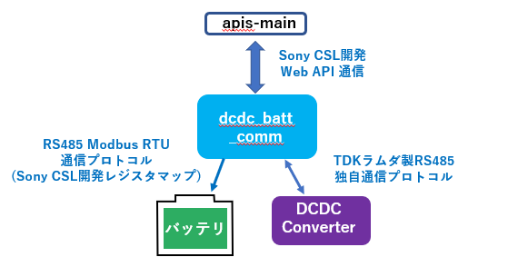

**apis-dcdc\_batt\_comm仕様書**
================================
**Rev 0.55**

**目次**
========

[1.用語・略語](#anchor1)

[2.概要](#anchor2)

[3.ソフトウェアディレクトリ構造](#anchor3)

[4.ソフトウェアモジュール概要](#anchor4)

&emsp;[4.1.ESSXServer](#anchor4-1)

&emsp;[4.2.EController(ESSXTypeOES)](#anchor4-2)

[5.ソフトウェアモジュール詳細](#anchor5)

&emsp;[5.1.ESSXServer](#anchor5-1)

&emsp;&emsp;[5.1.1.ESSXServerの起動方法](#anchor5-1-1)

&emsp;&emsp;[5.1.2.ESSXServerの起動オプション等](#anchor5-1-2)

&emsp;&emsp;[5.1.3.ESSXServerの設定ファイルについて](#anchor5-1-3)

&emsp;&emsp;[5.1.4.ESSXServerのREST APIと仕様](#anchor5-1-4)

&emsp;&emsp;&emsp;[5.1.4.1.REST APIのリクエスト及びレスポンスの値についての捕捉](#anchor5-1-4-1)

&emsp;[5.2.コントローラー](#anchor5-2)

&emsp;&emsp;[5.2.1ESSXtypeOES](#anchor5-2-1)

&emsp;[5.3.デバイス](#anchor5-3)

&emsp;&emsp;[5.3.1.EZA2500Device.py](#anchor5-3-1)

&emsp;&emsp;[5.3.2.BatteryEmulator](#anchor5-3-2)

&emsp;[5.4.低レベルデバイス](#anchor5-4)

&emsp;&emsp;[5.4.1.RS485(essx\_rs485.py)](#anchor5-4-1)

&emsp;&emsp;[5.4.2.ESSXModbusClient(essx\_modbus.py)](#anchor5-4-2)

**1.用語・略語**
==============

| **用語**        | **説明**                                                                                                                                     |
|-----------------|----------------------------------------------------------------------------------------------------------------------------------------------|
| apis-main       | 自律分散制御を可能にするSony CSLが開発した電力相互融通ソフトウェアである。                                                                   |
| Main Controller | apis-mainがインストールされた各ノードの状態や電力融通状態をリアルタイムで表示するSony CLSが開発したWebアプリケーションのソフトウェアである。 |
| EZA2500         | 本文ではTDKラムダ製EZA-2500-32048のカスタマイズ品を指す。                                                                                    |
|                 |                                                                                                                                              |
|                 |                                                                                                                                              |
|                 |                                                                                                                                              |
|                 |                                                                                                                                              |
|                 |                                                                                                                                              |
|                 |                                                                                                                                              |

**2.概要**
========

dcdc\_batt\_commはapis-mainからの指示に従って実際にハードウェアを制御し電力融通を実現するためのDevice Driverである。(図2-1参照) 制御対象のDCDC ConverterとしてTDKラムダ製のEZA2500を想定し、RS485を使用してTDKラムダ製独自プロトコルにより通信を行う。制御対象のバッテリはRS485上でModbus RTU通信プロトコルを使用して通信を行う想定で作られている。(レジスタマップはSony CSL開発の独自仕様) dcdc\_batt\_comm上にはPython Bottleを利用してWeb Serverが立っている。apis-mainとの通信はそのWeb Serverを利用してSony CSL開発のWeb APIを介して通信を行う。(apis-mainとのWeb APIの仕様に関してはapis-main仕様書を参照すること。)

&emsp;&emsp;&emsp;&emsp;&emsp;&emsp;&emsp;&emsp;&emsp;&emsp;&emsp;&emsp;&emsp;&emsp;&emsp;&emsp;&emsp;&emsp;図2-1

**3.ソフトウェアディレクトリ構造**
================================

以下にディレクトリ構造以下のようになっている。

drivers/  
&emsp;essx\_server.py bottleを利用したWebサーバ(ESSXServer)  
&emsp;dcdc\_batt\_comm.yml 設定用YAMLファイル  
&emsp;essx/ ESSX関連のpython module  
&emsp;eza2500/ EZA2500関連のpython module  
&emsp;battery\_emulator バッテリエミュレータ関連のpython module  

4.**ソフトウェアモジュール概要**
==============================

**4.1.ESSXServer**
--------------

REST形式のAPIを実装するメインとなるプログラムである。このプログラムを実行するとWeb Serverが立ちあがる。URLパスと処理の対応が記述されており、HTTPのRequestを受理すると適当な関数が呼ばれる。各関数はパラメータのチェックを行った後、コントローラーを呼び出す。コントローラーは以下が用意されている。  

-essx.essx\_type\_oes  

正常に処理が終了した場合はステータスコード200とその結果を仕様書に従ってJSONで返す。コントローラーにて例外を受けとった場合ステータスコード400と例外のメッセージをJSONにて返す単純な構造とし、デバイスと通信等を行う機能は後述するコントローラーに実装される。  

**4.2.Controller(ESSXTypeOES)**
---------------------------

ESSXServerからリクエストを受けとりデバイスにコマンドを送りレスポンスを返すソフトウェアモジュールである。エラー時のリトライ処理などもコントローラーで行う。

**5.ソフトウェアモジュール詳細**
==============================

**5.1.ESSXServer**
--------------

Userは下記のWeb APIにてMain Controllerと情報のやり取りを行うことができる。以下にそのWeb APIの仕様を説明する。

**5.1.1.ESSXServerの起動方法**

essxディレクトリ内で “python essx\_server.py”で起動する。実際のデバイスファイル(/dev/ttyO2等)や方向制御のGPIOへのアクセス権が必要なので必要に応じて sudoを行って/dev/ttyO2等のパーミッションを変更する必要がある。

**5.1.2.ESSXServerの起動オプション等**

usage: essx\_server.py \[-h\] \[--host HOST\] \[--port PORT\] \[--debug\]  
\[--config CONFIG\]  
ESS Server  
optional arguments:  
-h, --help show this help message and exit  
--host HOST  
--port PORT    
--debug  
--config CONFIG  

・-h, --help  
ヘルプメッセージを表示する。  

・--host  
TCP/IPで Listenするアドレス。defaultは localhost。他のホストからアクセスする必要がある場合はそのホストのIPアドレスまたは 0.0.0.0を指定する必要がある。  

・--port  
TCP/IPで Listenする ポート番号。defaultは 8080。  

・--debug  
デバッグメッセージを出すか否か  

・--config  
設定ファイルを指定する。デフォルトは dcdc\_batt\_comm.yml  

・--goodbye  
/essx/goodbye APIを有効かするか否か  

**5.1.3.ESSXServerの設定ファイルについて**

設定ファイルはYAML形式で記述する。デフォルトの設定ファイルはdcdc\_batt\_comm.ymlという名前でessx\_server.pyと同じディレクトリに置く必要がある。

ess\_system:  
&emsp;type: essx\_type\_oes  
&emsp;dcdc\_dev:  
&emsp;&emsp;name: dcdc1  
&emsp;&emsp;config: dcdc\_default\_eza2500  
&emsp;&emsp;class: 'ESSXRS485'  
&emsp;&emsp;params: \["/dev/ttyO2", 19200\]  
&emsp;&emsp;kwparams:  
&emsp;&emsp;&emsp;dir\_pin: "P8\_7"  

battery\_dev:  
&emsp;name: battery  
&emsp;config: battery\_emulator  
&emsp;class: 'ESSXModbus'  
&emsp;params: \[\]  
&emsp;kwparams:  
&emsp;&emsp;method: 'rtu'  
&emsp;&emsp;port: "/dev/ttyO5"  
&emsp;&emsp;timeout: 1  
&emsp;&emsp;baudrate: 9600  
&emsp;&emsp;dir\_pin: "P8\_9"  
&emsp;unit: 1 \#MODBUSアドレス  
&emsp;modbus\_adr\_rsoc: 30030  
&emsp;modbus\_adr\_status: 30031  

dcdc:  
&emsp;dcdc\_default\_eza2500:  
&emsp;&emsp;type: tdk\_eza2500  
&emsp;&emsp;number\_of\_dcdc\_error\_retry: 3 \#エラー時のリトライ回数  
&emsp;&emsp;number\_of\_timeout\_retry: 3 \#タイムアウト時のリトライ回数  
&emsp;&emsp;wait\_for\_retry: 0.1 \#リトライする場合の待ち時間  
&emsp;&emsp;config:  
&emsp;&emsp;&emsp;cib: 52 \#バッテリ上限電流  
&emsp;&emsp;&emsp;ubv: 40 \#バッテリ低電圧閾値  
&emsp;&emsp;&emsp;obv: 59 \#バッテリ過電圧閾値  
&emsp;&emsp;&emsp;ugv: 300 \#グリッド低電圧閾値  
&emsp;&emsp;&emsp;ogv: 400 \#グリッド過電圧閾値  
&emsp;&emsp;&emsp;bcf: 0x0003 \#コンバータ設定  
&emsp;&emsp;&emsp;cvb: 57.6 \#バッテリ目標電圧  
&emsp;&emsp;&emsp;dlb: 49 \#バッテリ放電終止電圧  
&emsp;&emsp;&emsp;cdb: 1.2 \#バッテリ充電上限予告電圧偏差  
&emsp;&emsp;&emsp;ddb: 1.8 \#バッテリ充電終止予告電圧偏差  
&emsp;&emsp;&emsp;drb: 0.00 \#バッテリドループ率  

battery:  
&emsp;battery\_emulator:  
&emsp;&emsp;type: battery\_emulator  
&emsp;&emsp;config:  
&emsp;&emsp;&emsp;battery\_voltage: 52.0  
&emsp;&emsp;&emsp;battery\_current: 20.0  
&emsp;&emsp;&emsp;force\_dcdc\_waiting: No  

**・設定項目詳細**

設定項目の詳細を以下に示す。なお、YAML設定ファイルの項目を「.」をセパレータとして表記をしている。

**・全般**

|                               |                                          |
|-------------------------------|------------------------------------------|
| **設定項目名**                | **設定内容**                             |
| ess\_system.type              | essx\_type\_oesのを指定する              |
| ess\_system.dcdc\_dev:        | DCDCの設定                               |
| ess\_system.battery\_dev:     | バッテリの設定                           |
| dcdc\. dcdc\_default\_eza2500 | dcdc\_devで設定したDCDCの詳細設定        |
| battery. battery\_emulator:   | battery\_devで設定したバッテリの詳細設定 |

**・DCDCデバイス関連**

|                                |                                                        |
|--------------------------------|--------------------------------------------------------|
| **設定項目名**                 | **設定内容**                                           |
| ess\_system.dcdc\_dev.name     | 任意の名称                                             |
| ess\_system.dcdc\_dev.config   | dcdc.XXXXXの指定(XXXXXに入る部分を指定する)            |
| ess\_system.dcdc\_dev.class    | dcdcが使用するデバイスのクラス                         |
| ess\_system.dcdc\_dev.params   | dcdcが使用するデバイスのクラスのコンストラクタの引き数 |
| ess\_system.dcdc\_dev.kwparams | dcdcが使用するデバイスのクラスのコンストラクタの引き数 |

**・バッテリデバイス関連**

|                                   |                                                           |
|-----------------------------------|-----------------------------------------------------------|
| **設定項目名**                    | **設定内容**                                              |
| ess\_system.battery\_dev.name     | 任意の名称                                                |
| ess\_system.battery\_dev.config   | battery.YYYYYの指定(YYYYYに入る部分を指定する)            |
| ess\_system.battery\_dev.class    | batteryが使用するデバイスのクラス                         |
| ess\_system.battery\_dev.params   | batteryが使用するデバイスのクラスのコンストラクタの引き数 |
| ess\_system.battery\_dev.kwparams | batteryが使用するデバイスのクラスのコンストラクタの引き数 |

**・dcdc\_devに使用できるクラスとその設定**

<table><tbody><tr class="odd"><td><strong>クラス名</strong></td><td><strong>設定項目名</strong></td><td><strong>設定内容</strong></td></tr><tr class="even"><td>
ESSXRS485

RS485を利用するときのクラス
</td><td>params</td><td>
[デバイスファイル, 通信速度]

例）

["/dev/ttyO2", 19200]
</td></tr><tr class="odd"><td></td><td>kwparams</td><td>
{"dir_pin": RS485方向制御PIN}

例）

{"dir_pin": "P8_7"}
</td></tr><tr class="even"><td></td><td>address1</td><td>DCDC側アドレス</td></tr><tr class="odd"><td></td><td>address2</td><td>ESSX側アドレス</td></tr></tbody></table>

**・battery\_devにて使用できるクラス**

<table><tbody><tr class="odd"><td><strong>クラス名</strong></td><td><strong>設定項目名</strong></td><td><strong>設定内容</strong></td></tr><tr class="even"><td>
ESSXModbus

Modbusを利用するときのクラス
</td><td>params</td><td>[]</td></tr><tr class="odd"><td></td><td>kwparams</td><td>
ModbusSerialClientのパラメータ

例）

{"method": "rtu", "port": "/dev/ttyO5", "timeout": 1, "baudrate": 9600, "dir_pin": "P8_9"}
</td></tr><tr class="even"><td></td><td>unit</td><td>modbusのアドレス</td></tr><tr class="odd"><td></td><td>modbus_adr_rsoc</td><td>rsocのアドレス</td></tr><tr class="even"><td></td><td>modbus_adr_status</td><td>statusのアドレス</td></tr></tbody></table>

**・DCDCの詳細設定**

|                                                            |              |                              |
|------------------------------------------------------------|--------------|------------------------------|
| **設定項目名**                                             | **設定内容** | **意味**                     |
| dcdc.dcdc\_default\_eza2500.type                           | tdk\_eza2500 | 任意の名称                   |
| dcdc.dcdc\_default\_eza2500.number\_of\_dcdc\_error\_retry | 3            | エラー時のリトライ回数       |
| dcdc.dcdc\_default\_eza2500.number\_of\_timeout\_retry     | 3            | タイムアウト時のリトライ回数 |
| dcdc\. dcdc\_default\_eza2500.wait\_for\_retry             | 0.1          |                              |
| dcdc\. dcdc\_default\_eza2500.config.cib                   | 52           | バッテリ上限電流             |
| dcdc\. dcdc\_default\_eza2500.config.ubv                   | 40           | バッテリ低電圧閾値           |
| dcdc\. dcdc\_default\_eza2500.config.obv                   | 59           | バッテリ過電圧閾値           |
| dcdc\. dcdc\_default\_eza2500.config.ugv                   | 300          | グリッド低電圧閾値           |
| dcdc\. dcdc\_default\_eza2500.config.ogv                   | 400          | グリッド過電圧閾値           |
| dcdc\. dcdc\_default\_eza2500.config.bcf                   | 0x0003       | コンバータ設定               |
| dcdc\. dcdc\_default\_eza2500.config.tbv                   | 57.6         | バッテリ目標電圧             |
| dcdc\. dcdc\_default\_eza2500.config.lbv                   | 49           | バッテリ放電終止電圧         |
| dcdc\. dcdc\_default\_eza2500.config.cud                   | 1.2          | バッテリ充電上限予告電圧偏差 |
| dcdc\. dcdc\_default\_eza2500.config.dld                   | 1.8          | バッテリ充電終止予告電圧偏差 |
| dcdc\. dcdc\_default\_eza2500.config.drb                   | 0.00         | バッテリドループ率           |

**・バッテリの詳細設定**

|                                                        |              |                                                              |
|--------------------------------------------------------|--------------|--------------------------------------------------------------|
| **設定項目名**                                         | **設定内容** | **意味**                                                     |
| battery.battery\_emulator.config.battery\_voltage      | 52.0         | バッテリ電圧暫定値                                           |
| battery.battery\_emulator.config.battery\_current      | 20.0         | バッテリ電流暫定値                                           |
| battery.battery\_emulator.config.force\_dcdc\_waiting: | No           | バッテリ融通不許可時にDCDCコンバータを待機モードにするか否か |

設定変更の例  
RS485の 低レベルデバイスの接続を /dev/ttyO5から /dev/ttyO2にする。  
params: \["/dev/ttyO2", 19200\]  
kwparams:  
dir\_pin: "P8\_7"  

**5.1.4.ESSXServerのREST APIと仕様**

基本的にはESSXServerは設定ファイルにひも付いたコントローラーのAPIを呼び出し、その戻りデータをJSONデータとしてクライアントに返す。リクエストとデータの実際のデータの詳細は4.2コントローラーの節に記載する。

**5.1.4.1.REST APIのリクエスト及びレスポンスの値についての捕捉**

**・battery\_operation\_statusの意味**

|                        |              |
|------------------------|--------------|
| **コントローラーの値** | **意味**     |
| 0x00                   | 融通不許可   |
| 0x01                   | 充電のみ許可 |
| 0x02                   | 放電のみ許可 |
| 0x03                   | 融通許可     |

現在BatteryEmulatorは0x00および0x03しか返さない。

**・operatinModeの値と文字列の対応**

|        |                            |
|--------|----------------------------|
| **値** | **文字列**                 |
| 0x00   | "Waiting"                  |
| 0x01   | "Hateronomy CV Charging"   |
| 0x02   | "Heteronomy CV"            |
| 0x22   | "Heteronomy CV"            |
| 0x04   | "Battery Autonomy"         |
| 0x14   | "Grid Autonomy"            |
| 0x34   | "Grid Autonomy CC Battery" |
| 0x41   | "Heteronomy CV"            |

**・alarmStateの値と文字列の対応**

|                       |               |
|-----------------------|---------------|
| **CSTの bit2, 3の値** | **文字列**    |
| 0                     | "No alarm"    |
| 1                     | "Light alarm" |
| 2                     | "Heavy alarm" |

alarmの文字列化  
1.  ALM1  
2.  CSTの bit2, 3  
3.  CSTの bit0,1  

の各値を4桁の16進数で表わしスペースを間に入れる。  
"0000 0000 0000"  
※ dcdc\_batt\_commより ALM1が最初の4桁、CSTの bit0,1が最後の4桁に修正されている。  

**・runningStateの文字列化**

|                      |             |
|----------------------|-------------|
| **CSTの bit0,1の値** | **文字列**  |
| 0                    | "off"       |
| 1                    | "charge"    |
| 2                    | "discharge" |

**5.2.コントローラー**
------------------

Userは下記のWeb APIにてMain Controllerと情報のやり取りを行うことができる。以下にそのWeb APIの仕様を説明する。

**5.2.1.ESSXtypeOES**

REST APIから呼び出され実際のデバイスを制御するコントローラーのクラスである。

コマンドは vrfyメソッドでチェックされたのち runメソッドで発行される。

REST API用のメソッドはその戻り値がそのままJSONデータとしてREST APIからWeb ブラウザに返される。

**5.2.1.1.応答速度の設計**

REST API用のメソッドは要求仕様書に沿ってDCDC以外のリクエストについては0.1sec(100msec)以内を目標として設計されている。  
DCDCコンバータの設定・反映確認リクエスト(/remote/get系API）については 0.6sec(600msec)以内、同じく状態確認リクエスト（/remote/set系API）は0.5s(500msec)以内を目標として設計されている。

**5.2.1.2.class ESSXTypeOES**

ESSXTypeOES(dcdc\_dev = None, bat\_dev = None, dcdc\_config = None, bat\_config = None, ad1 = 0, ad2 = 1, name = None)

コンストラクタ

-   dcdc\_dev: DCDCコンバータのクラス。具体的には EZA2500Deviceクラスのインスタンス

-   bat\_dev: バッテリのクラス。

-   dcdc\_config: DCDCの設定

-   bat\_config: バッテリの設定

-   ad1: DCDCと通信に必要なRS485のアドレス1

-   ad2: DCDCと通信に必要なRS485のアドレス2

-   name: DCDCの名称

インスタンスが作られるとバッテリの状態をチェックするスレッドが起動する。  
このスレッドでは10秒に一回バッテリの状態をチェックし設定ファイルで force\_dcdc\_waitingが True(YMLではYes)になっている場合はコマンド 1-4で 動作モードをwaitingにする。

**・vrfy(self, obj, params = {})**

-   コマンドのパラメータのチェックをする。問題があれば例外が発生する。  
    obj: コマンド (eza2500.Command0101等のインスタンスである)

-   params: そのコマンドに付随するパラメータ

コマンドのパラメータのチェックをする。問題があれば例外が発生する。例えば 17-4のパラメータをチェックするには

self.vrfy(self.com1704, {

'lgc': a, 'lgd': b,

'lbc': c, 'lbd': d

})

のように実行する。

パラメータのチェックはEZA2500のQエンコードデータにて仕様上許される範囲の値かどうか？という点においてのみ行われる。よって例えば運転モードについてはvrfyではチェックをしていない。これは上位のレイヤにおいてチェックされなければならない。

**・run(self, obj, params = {})**

-   obj: コマンド (eza2500.Command0101等のインスタ

-   ンスである)

-   params: そのコマンドに付随するパラメータ

コマンドのパラメータを送信し、レスポンスを待つ。エラーが発生した場合リトライを試みる。リトライ回数およびリトライの待ち時間はEssCommConfigで指定する。この時以下の設定が利用される。

-   number\_of\_dcdc\_error\_retry dcdcでエラーが発生した場合のリトライ数。指定がない場合は0である。

-   number\_of\_timeout\_retry 通信timeoutが発生した場合のリトライ数。指定がない場合は0である。

-   wait\_retry リトライ時の待ち時間(秒)。指定がない場合は0.1秒である。

エラーによるリトライは以下のケースに限られる。

-   レスポンスコードとして 0xfffd, 0xfffcが返ってきた場合。

-   不正な値(値の範囲やレスポンスコマンドが期待通りでない等)

-   チェックサムが間違っている場合。

それ以外は即時エラーとして終了する。

**5.2.1.3.REST API用のメソッド**

**・log\_data(self, params)**

-   params: 使用していない

/1/log/data, /battery/get のREST APIから呼ばれるメソッドである。

バッテリの状態および現在の設定値を仕様書に沿って表示する。

戻り値

以下のようなdictを返す

{

"battery\_voltage" : 200,

"battery\_rsoc" : 0,

"rsoc" : 0,

"battery\_comm\_err" : 0,

"ups\_operation\_schedule" : 0,

"charge\_discharge\_power" : 400,

"ups\_operation\_mode" : {

"mode" : 0,

"stop\_mode" : 0,

"parameter" : 0

},

"battery\_warning" : 0,

"battery\_status" : 0,

"battery\_operation\_status" : 0,

"battery\_current" : 2,

"dischargeable\_time" : {

"hour" : 0,

"minute" : 0

},

"system\_time" : {

"minute" : 0,

"year" : 0,

"month" : 0,

"day" : 0,

"hour" : 0

}

}

**・remote\_ioctl\_set(self, params)**

-   params: 使用していない

/remote/ioctl/setの REST APIから呼ばれるメソッドである。ｄ

dcdc\_batt\_configの設定に沿ってDCDCの値を設定する。  
このメソッドは以下のEZA2500のコマンドを順次発行する。

-   6-1 CIB, DIGの取得

-   6-4 UBV, UGV, OBV, OGV, CIB, DIG の設定

-   7-4 BCF, DLB, CDB, DDB

-   3-4 CVB, DRN の設定

6-1を発行するのは CIB, DIGとして現在の値を設定するためである。  
戻り値としてDCDCから戻ってきた値ではなく設定した値そのものを返す。  
BCFは 0x0000 形式の文字列として返す。

戻り値

{

"dcdc\_converter\_name": "dcdc1",

"dcdc\_setup\_parameter": {

"bcf": "0x000b",

"cdb": 6,

"cib": 52.08,

"cvb": 48,

"ddb": 1,

"dlb": 48,

"drb": 0.0,

"obv": 48,

"ogv": 380,

"ubv": 48,

"ugv": 380,

}

**・remote\_ioctl\_get(self, params)**

-   params: 使用していない。

/remote/ioctl/get の REST APIから呼ばれるメソッドである。  
/1/log/dataと /remote/getのデータの両方を返す。

{

"battery\_comm\_err": 0,

"battery\_current": 2.0,

"battery\_operation\_status": 0,

"battery\_rsoc": 0.0,

"battery\_status": 0,

"battery\_voltage": 200,

"battery\_warning": 0,

"charge\_discharge\_power": 400.0,

"dischargeable\_time": {

"hour": 0,

"minute": 0,

},

"meter": {

"ib": 49.9987060546875,

"ig": 49.9958984375,

"tmp": 20,

"vb": 240,

"vg": 240,

"wb": 100,

"wg": 100,

},

"param": {

"cib": 52,

"dig": 7.8125,

"obv": 59,

"ogv": 400,

"ubv": 40,

"ugv": 300,

},

"powermeter": {

"i1": 0,

"kwh1": 0,

"kwh2": 0,

"p1": 0,

"p2": 0,

"v1": 0,

},

"rsoc": 0.0,

"status": {

"alarm": "0000 0000 0000",

"alarmState": "No alarm",

"operationMode": "Waiting",

"runningState": "off",

"status": "0x0000",

"statusName": "Ignore",

},

"system\_time": {

"day": 0,

"hour": 0,

"minute": 0,

"month": 0,

"year": 0,

},

"ups\_operation\_mode": {

"mode": 0,

"parameter": 0,

"stop\_mode": 0,

},

"ups\_operation\_schedule": 0,

"vdis": {

"drg": 0.25,

"dvg": 240,

},

}

**・/remote/get(self, params)**

-   params: 使用していない

/remote/get および /dcdc/get の REST APIから呼ばれるメソッドである。

このメソッドは以下のEZA2500のコマンドを順次発行する

-   1-1

-   2-1

-   4-1

-   9-1

-   10-1

-   6-1

戻り値

status\["status"\]は 1-1の modeの16進値である。なお値は変換等なくEZA2500の値がそのまま使われる。  
status\["alarmState"\]は 2-1の CST bit2,3を文字列化したもの。  
status\["alarm"\]は CSTの bit0,1 およびCSTの bit2,3 および 9-1の alm1を文字列化したもの。  
status\["runningState"\]は CSTの bit0,1を文字列化したもの。  
status\["operationMode"\]は 1-1の modeを文字列化したもの。

{

"meter": {

"ib": 52.08,

"ig": 7.8125,

"tmp": 20,

"vb": 48,

"vg": 380,

"wb": 98.876953125,

"wg": 98.876953125,

},

"param": {

"cib": 52,

"dig": 7.8125,

"obv": 59,

"ogv": 400,

"ubv": 40,

"ugv": 300,

},

"powermeter": {

"i1": 0,

"kwh1": 0,

"kwh2": 0,

"p1": 0,

"p2": 0,

"v1": 0,

},

"status": {

"alarm": "0000 0000 0000",

"alarmState": "No alarm",

"operationMode": "Waiting",

"runningState": "off",

"status": "0x0000",

"statusName": "Ignore",

},

"vdis": {

"drg": 0.25,

"dvg": 380,

},

}

**・remote\_get\_status(self, params)**

-   params 使用していない

このメソッドは以下のEZA2500のコマンドを順次発行する。

-   1-1

-   2-1

-   10-1

戻り値

status\["alarmState"\]は 2-1の CST bit2,3を文字列化したもの。  
status\["runningState"\]は CSTの bit0,1を文字列化したもの。  
status\["operationMode"\]は 1-1の modeを文字列化したもの。

{

"meter": {

"ib": 52.08,

"ig": 7.8125,

"tmp": 20,

"vb": 48,

"vg": 380,

"wb": 98.876953125,

"wg": 98.876953125,

},

"status": {

"alarmState": "No alarm",

"operationMode": "Waiting",

"runningState": "off",

},

}

**・remote\_set(self, params)**

-   params\['mode'\]: 必須

-   params\['dvg'\]: 必須

-   params\['drg'\]: 必須

-   params\['dig'\]: 必須

/remote/set および /dcdc/set の REST APIから呼ばれるメソッドである。

REST APIの仕様書上はmode, dvg, drg, digらのパラメータは省略されても過去の値を使用することになっているが、このクラスで省略はできない。よってキャッシュを上位のレイヤで行い必ず指定しなくてはならない。

modeは当初から16進数の文字列(EZA2500値)で指定するようになっていたため変換等は行わない。

このメソッドは以下のEZA2500のコマンドを順次発行する。

-   4-4 DVG, DRGの設定

-   6-4 DIGの設定(UBV, UGV, OBV, OGV, CIBは設定より得る)

-   1-4 modeの設定

-   2-1

-   9-1

-   10-1

2-1, 9-1, 10-1を発行するのは戻り値に必要だからである。

status\["status"\]は 1-4の modeの16進値である。  
status\["alarmState"\]は 2-1の CST bit2,3を文字列化したもの。  
status\["alarm"\]は CSTの bit0,1 およびCSTの bit2,3 および 9-1の alm1を文字列化したもの。  
status\["runningState"\]は CSTの bit0,1を文字列化したもの  
status\["operationMode"\]は 1-4の modeを文字列化したもの

戻り値

{

"meter": {

"ib": 52.08,

"ig": 7.8125,

"tmp": 20,

"vb": 48,

"vg": 380,

"wb": 98.876953125,

"wg": 98.876953125,

},

"param": {

"cib": 52,

"dig": 7.8125,

"obv": 59,

"ogv": 400,

"ubv": 40,

"ugv": 300,

},

"status": {

"alarm": "0000 0000 0000",

"alarmState": "No alarm",

"operationMode": "Heteronomy CV",

"runningState": "off",

"status": "0x0002",

"statusName": "Ignore",

},

"vdis": {

"drg": 0.0999755859375,

"dvg": 380,

},

}

**・/remote\_set\_current(self, params)**

-   params\['dig'\]: 必須

/remote/set/current および /dcdc/set の REST APIから呼ばれるメソッド

上位のレイヤから mode, dvg, drgをパラメータとして渡してもよいがその  
パラメータが使われることはない。

REST APIの仕様書上は digらのパラメータは省略されても過去の値を使用することになっているが、このクラスで省略はできない。よってキャッシュを上位のレイヤで行い必ず指定しなくてはならない。

このメソッドは以下のEZA2500のコマンドを順次発行する。

-   6-4 DIGの設定(UBV, UGV, OBV, OGV, CIBは設定より得る)

-   10-1

10-1を発行するのは戻り値に必要だからである。

戻り値

{

"meter": {

"ib": 52.08,

"ig": 7.8125,

"tmp": 20,

"vb": 48,

"vg": 380,

"wb": 98.876953125,

"wg": 98.876953125,

},

"param": {

"cib": 52,

"dig": 7.8125,

"obv": 59,

"ogv": 400,

"ubv": 40,

"ugv": 300,

},

}

**・/remote\_set\_voltage(self, params)**

-   params\['dvg'\]: 必須

-   params\['drg'\]: 必須

/remote/set/voltage および /dcdc/setの REST APIから呼ばれるメソッド

上位のレイヤから mode, digをパラメータとして渡してもよいがそのパラメータが使われることはない。

REST APIの仕様書上は dvg, drgらのパラメータは省略されても過去の値を使用することになっているが、このクラスで省略はできない。よってキャッシュを上位のレイヤで行い  
必ず指定しなくてはならない。

このメソッドは以下のEZA2500のコマンドを順次発行する。

-   4-4 DVG, DRGの設定

-   10-1

10-1を発行するのは戻り値に必要だからである。

戻り値

{

"meter": {

"ib": 52.08,

"ig": 7.8125,

"tmp": 20,

"vb": 48,

"vg": 380,

"wb": 98.876953125,

"wg": 98.876953125,

},

"vdis": {

"drg": 0.0999755859375,

"dvg": 299.98291015625,

},

}

**5.3.デバイス**
------------

デバイスはコントローラーと低レベルデバイスの中間に位置し下層からやってきたデータをコントローラーが扱い易い形式にし、下層デバイスにデータを送るモジュールである。

**5.3.1.EZA2500Device.py**

コントローラーから呼び出され実際の低レベルデバイスにデータを送るクラスである。

**・コンストラクタ・メソッド詳細**

EZA2500Device(dev = None, timeout = None)

**・コンストラクタ**

-   dev: 低レベルデバイスのインスタンスである。

-   timeout: read/writeでこの時間が経過するまでにデータが読めない場合はTimeoutExceptionが発生する。

**5.3.1.1read(self, size)**

sizeバイトデータを低レベルデバイスから読む。

低レベルデバイスからデータは read()で読むが必ずしも一回で sizeバイト読まれるとは限らない。  
sizeバイトに足りない場合は続けて残りのデータを読み、最終的にsizeバイト読まれたら  
そのデータを返す。

最終的にsizeバイト読みこむまでtimeout以上経過したら例外が発生する。

**・注意**  
低レベルデバイスのread()には割込めない。そこで、低レベルデバイスのtimeoutを10msecとしread()を抜けた段階でtimeout時に達していたら例外を発生としている。この粒度の関係で10msecより短かい時間での timeoutはありえない。  
timeoutを10msecとしても 最悪20msecかかることが考えられる。  
また、低レベルデバイスのread()のtimeoutはそもそも精度が高くないので timeoutを  
動作の基準として期待はできない。

**5.3.1.2.write(self,size)**

sizeバイトデータを低レベルデバイスへ書く。

低レベルデバイスへデータは write()で読むが必ずしも一回で sizeバイト書かれるとは限らない。＃読むが--&gt;書き込むがsizeバイトに足りない場合は続けて残りのデータを書き、最終的にsizeバイト書くまで続ける。

最終的にsizeバイト書くまでtimeout以上経過したら例外が発生する。なお、実際にRS485に書くデータはサイズが小さいので一回で書けないということは無いようである。

**5.3.2.BatteryEmulator**

　バッテリエミュレータと通信を行うデバイス

**・コンストラクタ・メソッド詳細**

BatteryEmulator(dev = None, modbus\_adr\_rsoc = None, modbus\_adr\_status = None, unit = 0x1):

**・コンストラクタ**

-   dev: 低レベルデバイスのインスタンス。具体的にはESSXRS485

-   modbus\_adr\_rsoc RSOCの読み出しアドレス 30030のように指定する

-   modbus\_adr\_status statusの読み出しアドレス30031のように指定する

-   unit modbusのunit番号

・read\_rsoc(self):

直近のrsocデータを読む。

・read\_status(self):

直近のstatusデータを読む。

・remote\_rsoc(self):

rsocを取得するコマンドを発行する。

・remote\_status(self):

statusを取得するコマンドを発行する。

・check\_battery(self):

(rsoc, battery\_operation\_status, commerr) からなるタプルを返す。

rsocは 0.0から 100.0までの float

battery\_operation\_statusは 融通不可: 0, 充電のみ許可: 1, 放電のみ許可: 2, 融通許可: 3

cmmerrは 通信エラーが発生したか(True)否か(False)

battery\_operation\_statusは現在 0と3しか返さない。

**5.4.低レベルデバイス**
--------------------

**5.4.1.RS485(essx\_rs485.py)**

RS485のデバイスに(/dev/ttyO2, /dev/ttyO5）にアクセスする低レベルのデバイス制御クラスである。

serial.Serialを継承しており pySerialの全てのメソッドが使用できる。

**・コンストラクタ・メソッド詳細**

ESSXRS485(\*args, \*\*kwargs)

**・コンストラクタ**

serial.Serialの全パラメータに加え dir\_pin というオプションが追加されている。  
/dev/ttyO2を利用する際には P8\_7、/dev/ttyO5を利用する際には P8\_9を指定する。

指定しない場合は P8\_9がGPIOの対応ピンになる。(/dev/ttyO5の利用前提)

**・注意**

デフォルトが P8\_7になっていない。

&lt;例&gt;  
dev = ESSXRS485("/dev/ttyO2", 115200, dir\_pin = 'P8\_7')

・write(self, b):

GPIOの対応ピンのHIGH, LOWを切替えて writeをするメソッド

**5.4.2.ESSXModbusClient(essx\_modbus.py)**

pymodbusモジュールに含まれる ModbusSerialClientを拡張したクラス。pymodbusのModbusSerialClientは直接内部で serial.Serialを生成し使用するコードになっている。

しかし、本アプリケーションではGPIOのPIN制御をするために、 serial.Serialを継承したクラス(ESSXRS485)を利用する必要がある。そこでModbusSerialClientを拡張し、コンスタラクタとconnect()メソッドを上書きして新たにクラスを作成する。

動作仕様に関しては通信デバイスとしてESSXRS485を使うだけでインターフェース等はModbusSerialClientと同じであるため割愛する。

**6.OSSライセンス**
=================

以下にdcdc\_batt\_commが使用するソフトウェアとそのOSSライセンスの情報を記載する。

■dcdc\_batt\_commで使用されるソフトウェアとそのOSSライセンス情報

| ソフトウェア | バージョン | ライセンス  | コード改変 |
|--------------|------------|-------------|------------|
| Python       | 2.7.9      | PSL License | 無         |
| Bottle       | 0.12.13    | MIT License | 無         |
| PyYAML       | 3.12       | MIT License | 無         |
| pymodbus     | 1.5.2      | BSD License | 無         |
| pyserial     | 3.4        | BSD License | 無         |

※諸事情によりソフトウェアバージョンは変更される可能性がある。

  [**1.** **用語・略語** 4]: #用語略語
  [**2.** **ディレクトリ構造** 5]: #ソフトウェアディレクトリ構造
  [**3.** **開発言語及び開発ライブラリ** 5]: #_Toc50994385
  [**4.** **ソフトウェアモジュール概要** 6]: #ソフトウェアモジュール概要
  [**4.1.** **ESSXServer** 6]: #essxserver
  [**4.2.** **EController(ESSXTypeOES)** 6]: #controlleressxtypeoes
  [**5.** **詳細** 7]: #ソフトウェアモジュール詳細
  [**5.1.** **ESSXServer** 7]: #essxserver-1
  [**5.1.1.** **ESSXServerの起動方法** 7]: #essxserverの起動方法
  [**5.1.2.** **ESSXServerの起動オプション等** 7]: #essxserverの起動オプション等
  [**5.1.3.** **ESSXServerの設定ファイルについて** 8]: #essxserverの設定ファイルについて
  [**5.1.4.** **ESSXServerのREST APIと仕様** 12]: #essxserverのrest-apiと仕様
  [**5.1.4.1.** **REST APIのリクエスト及びレスポンスの値についての捕捉** 12]: #rest-apiのリクエスト及びレスポンスの値についての捕捉
  [**5.2.** **コントローラー** 14]: #コントローラー
  [**5.2.1** **ESSXtypeOES** 14]: #essxtypeoes
  [**5.3.** **デバイス** 25]: #デバイス
  [**5.3.1** **EZA2500Device.py** 25]: #eza2500device.py
  [**5.3.2** **BatteryEmulator** 26]: #batteryemulator
  [**5.4.** **低レベルデバイス** 27]: #低レベルデバイス
  [**5.4.1** **RS485(essx\_rs485.py)** 27]: #rs485essx_rs485.py
  [**5.4.2** **ESSXModbusClient(essx\_modbus.py)** 27]: #essxmodbusclientessx_modbus.py
